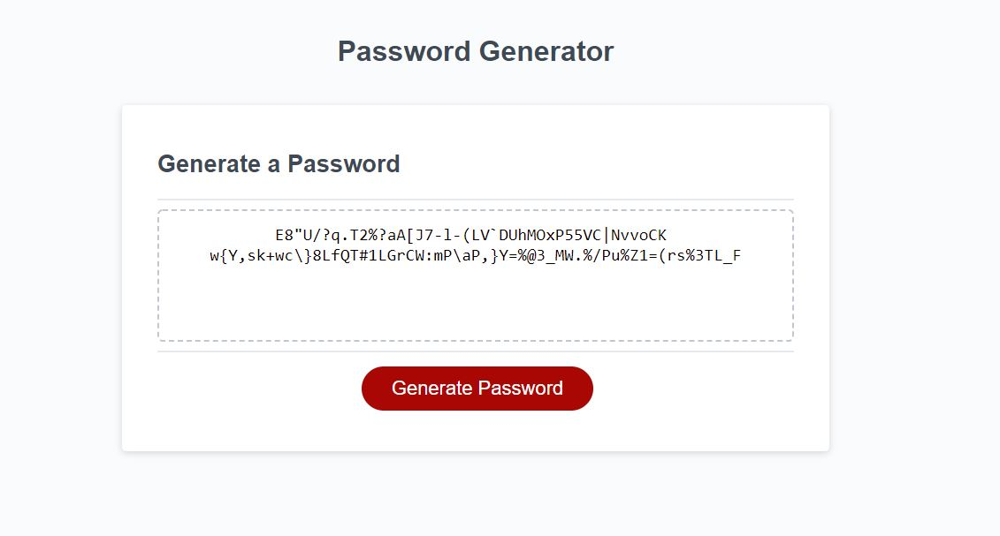

# friendly-parakeet-Week-3-challenge
for this challenge we were tasked with creating a password generator where the user could chose a password between the lenght of between 128 and 8 charcters. To begin I wrote out the psuedocode as comments to give me a back bone to my project. I first created the different arrays with the different options the could use to make up the password. the user has 4 categorys to choose from special Characters, Uppercase, Lowercase, and Numbers. I then created a function to randomly pick an item from an array to choose  the elements of the password. the next functions I created were to get the lenght and the options that the user wants to use in the passwords. in these functions I created if-statments to catch if the user doesnt give a number for length between 8 and 128 and also if statment if the user fails to choose an option for what the password should be made of. the last function I made actually makes the password it uses two arrays made from the option function. the two arrays are the main bulk array that contains all of the elements chosen from the options and an special essentail array that contains one of each option. the options from the essentail array will be pulled randomly and put in the password then deleted from the array this is to insure that at least one option will be added.

## Lessons Learned

the lessons I learned from this this was more of the reinforcment of javascript both syntax and also the logic behind the syntax. this lesson also reinforced creating functions and creating clean code that is easy to read and understand and also how to come up with solutions to specific problems.

## Screenshots

## Documentation

[GitHub Repo](https://github.com/allenharborth9835/friendly-parakeet-Week-3-challenge)
[Live Page on Github](allenharborth9835.github.io/friendly-parakeet-Week-3-challenge/)